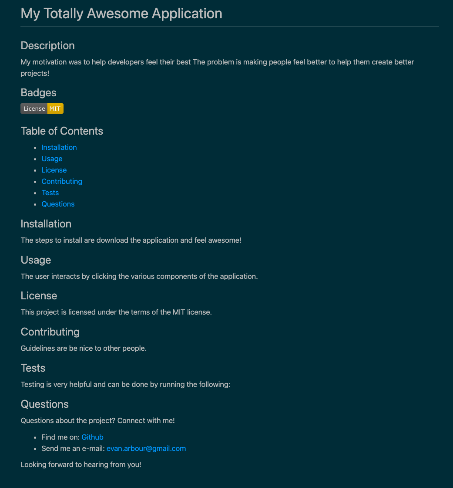

# Creating A README Generator

## Description

As developers, creating a high-quality README file is essential to helping other developers understand your project, increase collaboration, and ultimately elevate our projects! Sitting down and creating the README can sometimes feel just as daunting as the actual project itself. This application helps automate that process. Spend more time creating code and less time drafting the README file.

## Installation

The installation of this application is through Node.js via the Inquirer package invoked by using the following command:

```bash
node index.js
```

## Usage

The user interacts by answering multiple prompts that will dynamically update the various sections of the README file such as: "Description", "Installation", and "Usage." The application also creates a responsive Table of Contents in case the README is long: the user can click the links inside and will be taken directly to that section of the file.

## License

This project is licensed under the terms of the MIT license.

## Functionality

A [video walkthrough](https://drive.google.com/file/d/1MpfUK16CzXg2U3STU45aJYBMY2mH_x1k/view) of the usage of the application.

A sample README file generated using the application:


## Questions

Questions about the project? Connect with me!

- Find me on: [Github](https://github.com/evanarbour)
- Send me an e-mail: evan.arbour@gmail.com

Looking forward to hearing from you!
